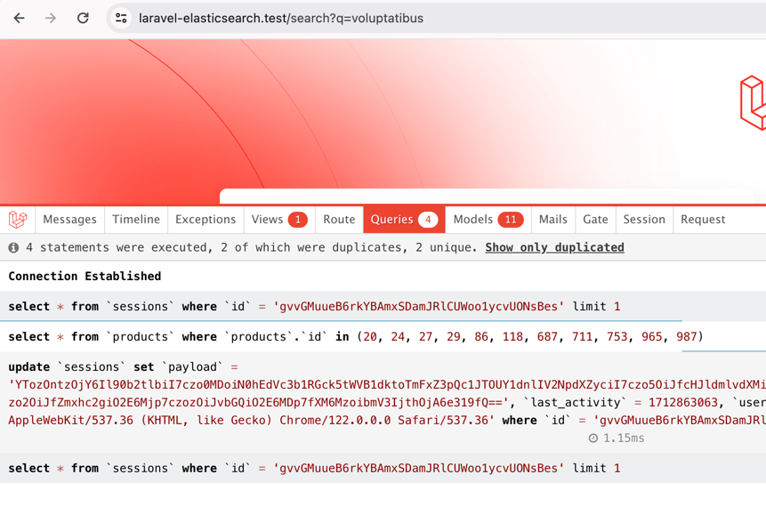
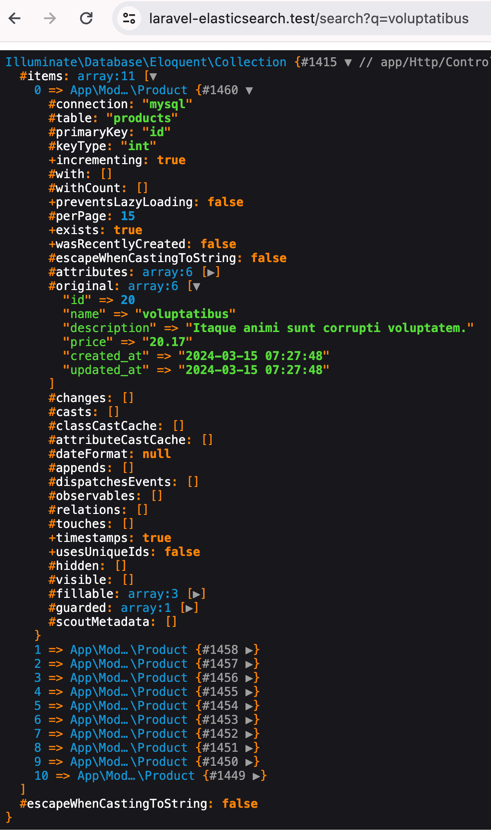

## Laravel v11 | Elasticsearch
Use
[Scout](https://laravel.com/docs/11.x/scout), [Elastic-Client](https://github.com/babenkoivan/elastic-client) and [Elastic-Scout-Driver](https://github.com/babenkoivan/elastic-scout-driver) 

## Setup
```
composer install
php artisan migrate
php artisan db:seed
php artisan scout:import "App\Models\Product"
```

[Controller](https://github.com/nAa6666/laravel-elasticsearch/blob/main/app/Http/Controllers/IndexController.php)
```
Product::search(sprintf('name:%s', $request->q))->take(20)->get();
```
[Query string syntax](https://www.elastic.co/guide/en/elasticsearch/reference/current/query-dsl-query-string-query.html#query-string-syntax)
## Result


